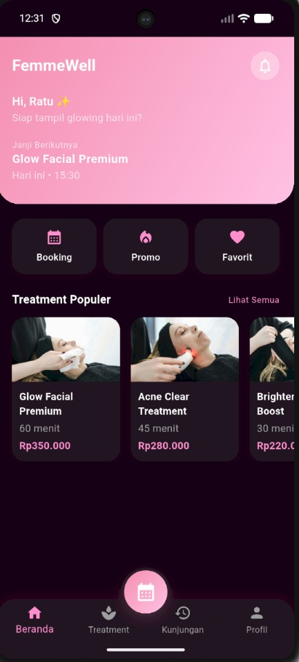
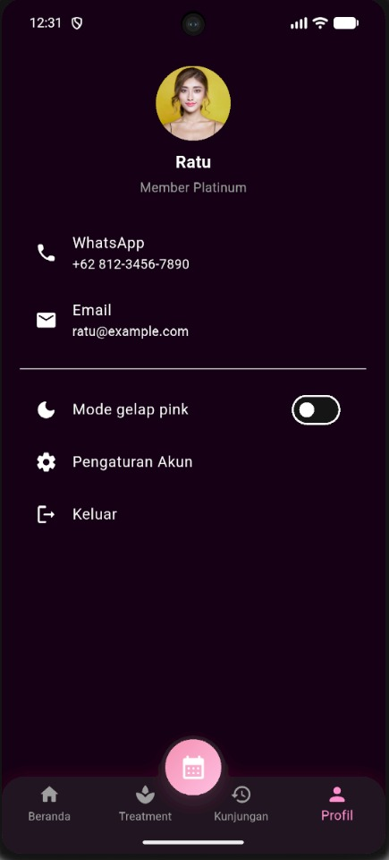
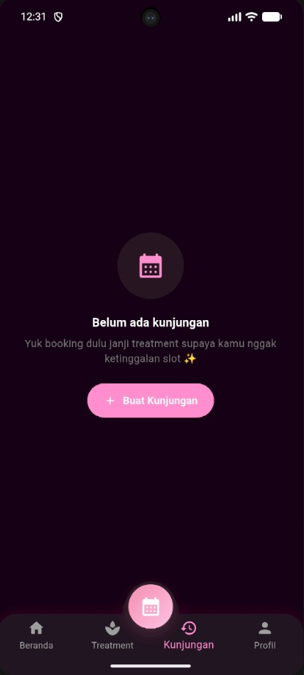
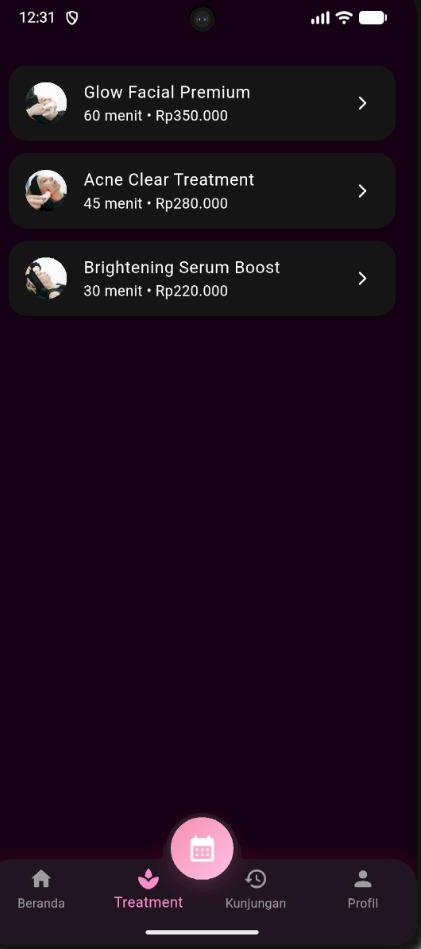

# FemmeWell

Aplikasi mobile klinik kecantikan dengan nuansa pink yang elegan, dibuat menggunakan Flutter.  
Pengguna dapat melihat daftar treatment, melakukan booking janji, serta memantau riwayat kunjungan dengan tampilan yang manis dan modern.

---

## 👤 Identitas

| Keterangan | Data |
|-----------|------|
| *Nama*  | Ratu Dian Septiani |
| *NIM*   | 14022300029 |
| *Kelas* | 5B-INF |


---

## ✨ Deskripsi Singkat

FemmeWell adalah aplikasi booking klinik kecantikan yang memudahkan pengguna dalam:

- Memilih treatment kecantikan
- Memesan jadwal treatment secara cepat
- Melihat riwayat kunjungan beserta statusnya
- Mengaktifkan mode light/dark pink sesuai preferensi

---

## 🌸 Fitur Utama

1. *Beranda (Home)*
   - Header dengan sapaan personal dan info janji berikutnya.
   - Quick menu: Booking, Promo, Favorit.

2. *Daftar Treatment*
   - List treatment lengkap dengan gambar, durasi, dan harga.
   - Halaman detail treatment + tombol "Booking Sekarang".

3. *Booking Kunjungan*
   - Form pemesanan: nama, treatment, tanggal, jam.
   - Menyimpan booking ke riwayat kunjungan.

4. *Kunjungan (Riwayat)*
   - *Empty state cantik* jika belum ada kunjungan.
   - List kartu kunjungan berisi:
     - Treatment
     - Waktu
     - Lokasi
     - Status (dengan badge warna)

5. *Profil*
   - Informasi pengguna, kontak, dan pengaturan tema.
   - Toggle *Mode Gelap Pink*.

6. *Floating Booking Button*
   - Tombol melayang dengan gradient pink, terletak di tengah bottom bar.

---

## 🛠 Tech Stack

- *Flutter*
- *Dart*
- Target utama *Android* (bisa untuk iOS)

---

## 🚀 Cara Menjalankan Project

1. Clone repository:
   ```bash
   git clone <url-repo>
   cd femmewell
2. Cek instalasi flutter:
   flutter --version
3. Install dependencies:
   - flutter pub get
4. Jalankan aplikasi:
   - flutter run

---

## 📁 Struktur Singkat Project

-lib/main.dart
-Berisi seluruh UI utama:
-Theme controller
-MainScreen + Bottom Navigation
-HomePage, TreatmentPage, VisitsPage, ProfilePage
-BookingPage, TreatmentDetailPage
-Model data (TreatmentData & VisitData)

## ScreenshotSemua Halaman





